# SilverBridge의 CareAI

## 1. 프로젝트 소개

CareAI는 독거노인 및 취약계층을 대상으로 설계된 의료 AI 통합 서비스입니다.

> 2050년, 대한민국 인구의 40%는 65세 이상 시니어입니다.
> 1인 가구 노인의 치매 유병률은 52.6%로 전체 가구 형태 중 가장 높고,
> 고독사의 90.6%는 집 안에서 발생합니다.

AI 기반 독거노인 통합 케어 플랫폼 — 위험 감지 → 의료 상담 → 병원 예약까지 하나의 흐름으로 연결합니다. 기존 서비스가 '알려주는 것'에 집중했다면, SilverBridge CareAI는 대처하게 만드는 것까지 포함합니다.

주요 기능은 크게 3가지입니다.

### 1. 위급 상황: 실시간 영상 AI가 낙상·화재·흉기를 감지하면 자동 신고 및 보호자·관리자에게 즉시 알림

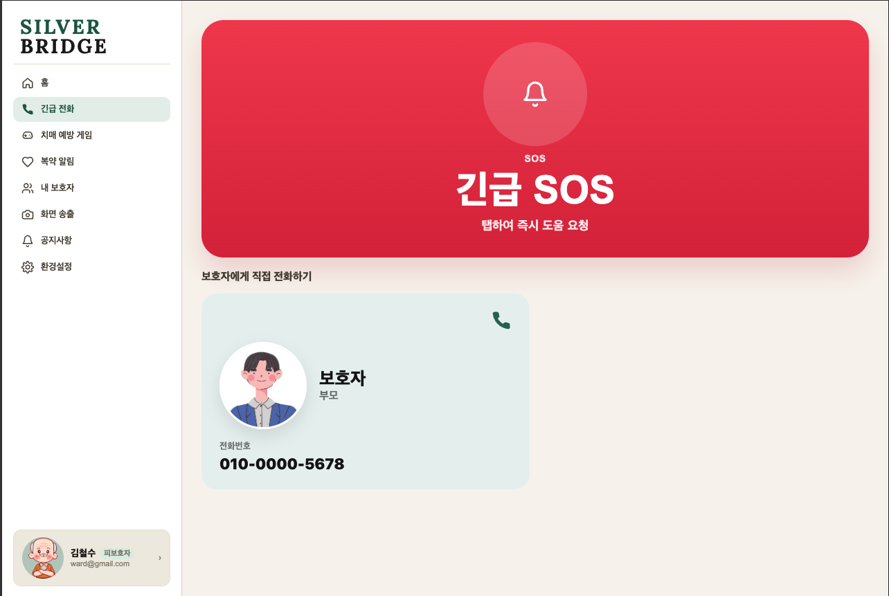

### 2. 병원 예약: AI 의료 챗봇으로 증상 상담 → 진료과 추천 → 병원 예약까지 원스톱 연결

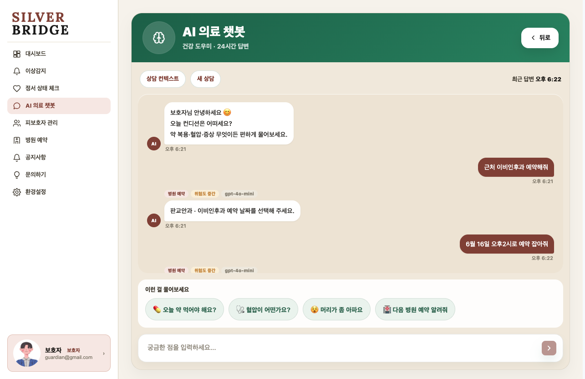

### 3. 정서 케어: AI 말벗·정서 분석·치매 예방 인지훈련으로 지속적 건강 관리

(개발 예정)

SilverBridge는 독거 노인 및 취약계층을 대상으로, 위험 상황을 감지하는 것에서 끝나지 않고 의료 상담과 병원 예약까지 자연스럽게 이어주는 의료 AI 통합 서비스입니다.

## 2. 주요 기능

### 2.1 공통 인증

- 이메일 로그인 / 카카오 소셜 로그인
- 회원가입 / 비밀번호 찾기·재설정
- JWT 기반 세션 유지 및 계정 복구
- 역할별(피보호자·보호자) 화면 분기
  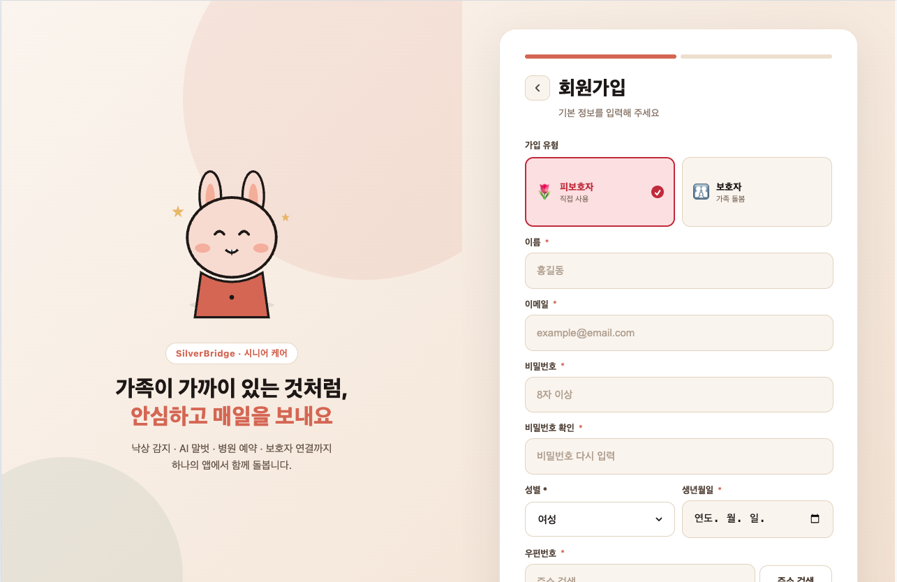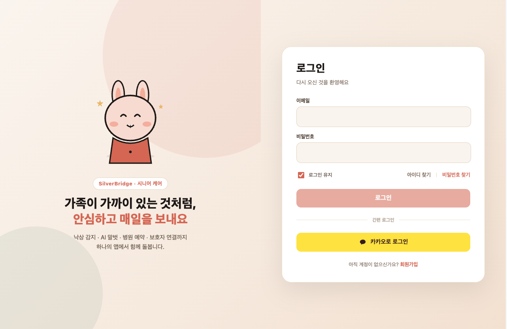

### 2.2 피보호자 화면

- 실시간 영상 송출 화면
- AI 이상감지 결과 화면 (화재·흉기·낙상)
- 내 보호자 목록 조회
- 보호자 연결 요청 수락 / 거절 / 해제
- 환경설정
- AI 말벗 대화 화면
- 치매 예방 인지훈련 게임 화면
  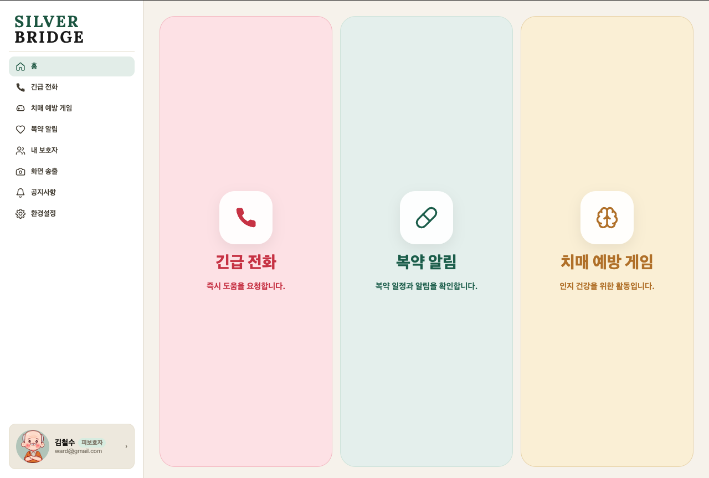
  
  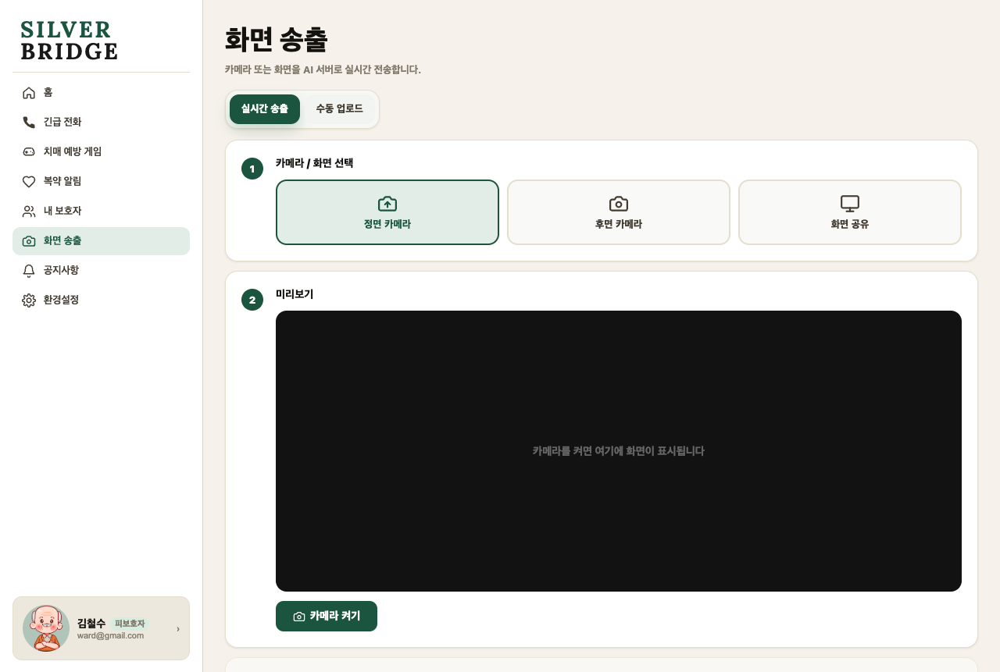
  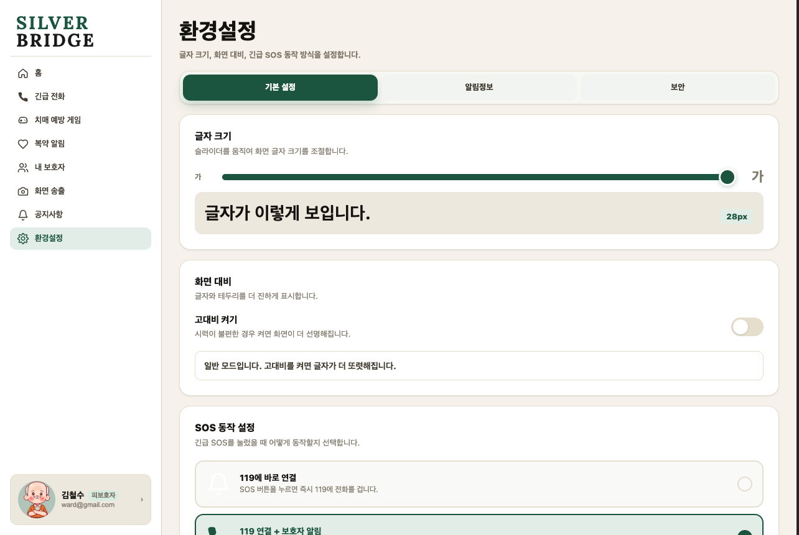

### 2.3 보호자 화면

- 보호자 홈 대시보드 (피보호자 상태 실시간 확인)
- 피보호자 목록 조회 / 등록 요청 / 요청 내역 / 연결 해제
- AI 이상감지 이력 조회
- AI 의료 챗봇 화면 (응급 증상·병원 예약·일반 문의 모드 선택)
- 병원 검색·예약·복약 알림 화면
  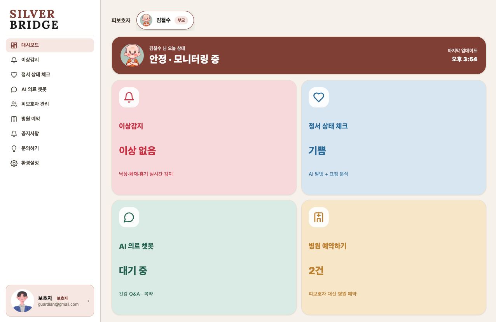
  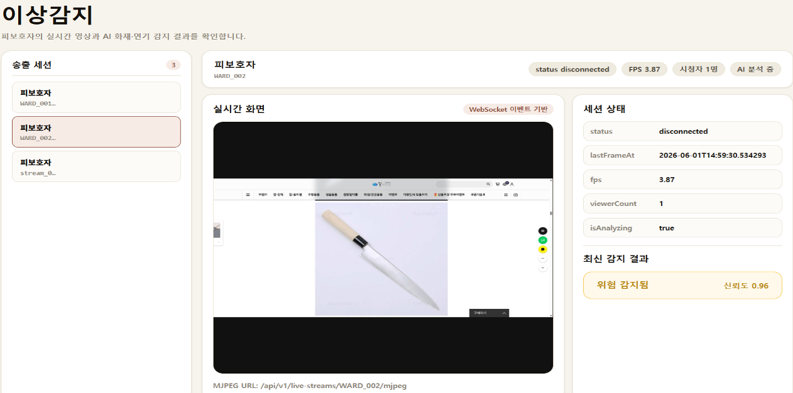
  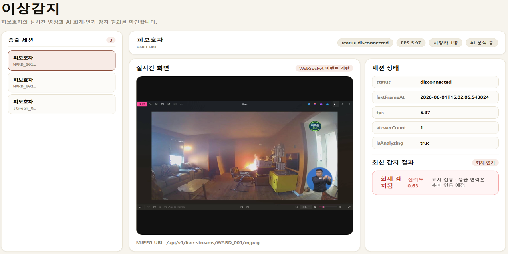
  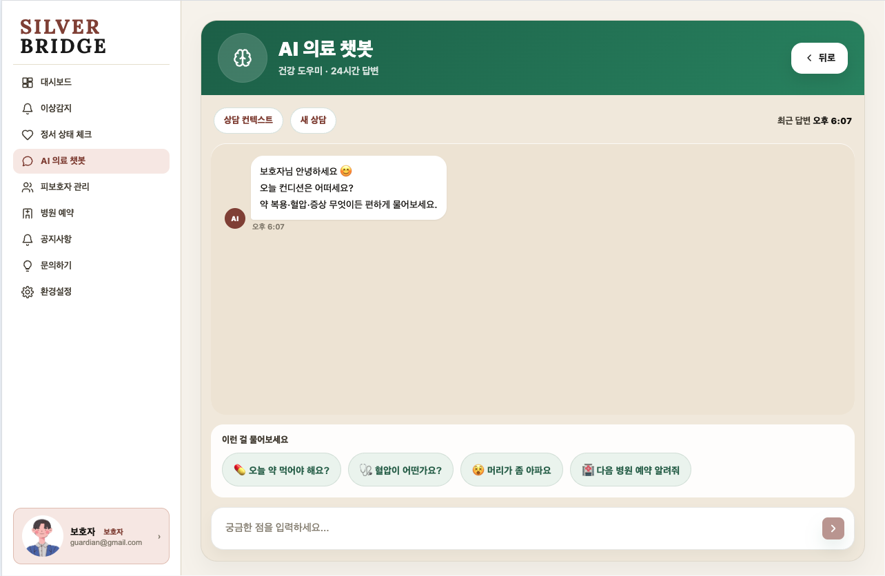
  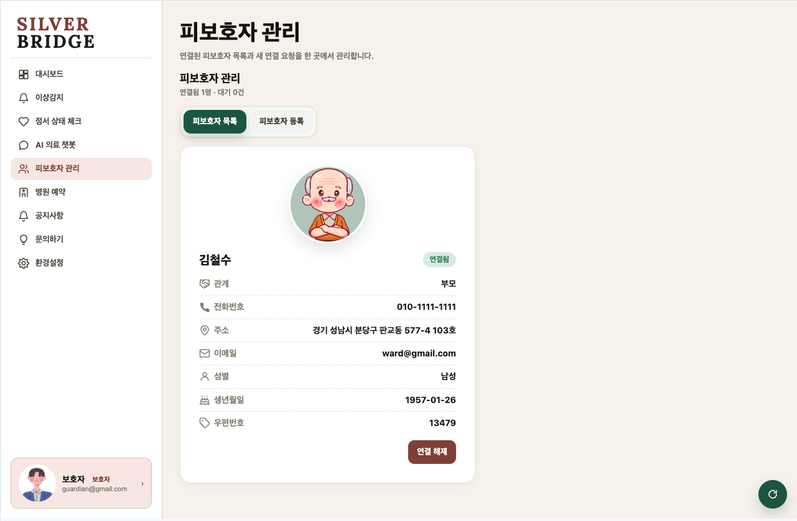

### 2.4 알림

- 웹 푸시 알림
- 이메일 / SMS 알림
- 카카오 알림톡 (연동 진행 중)
- 알림 유형별 설정 화면
  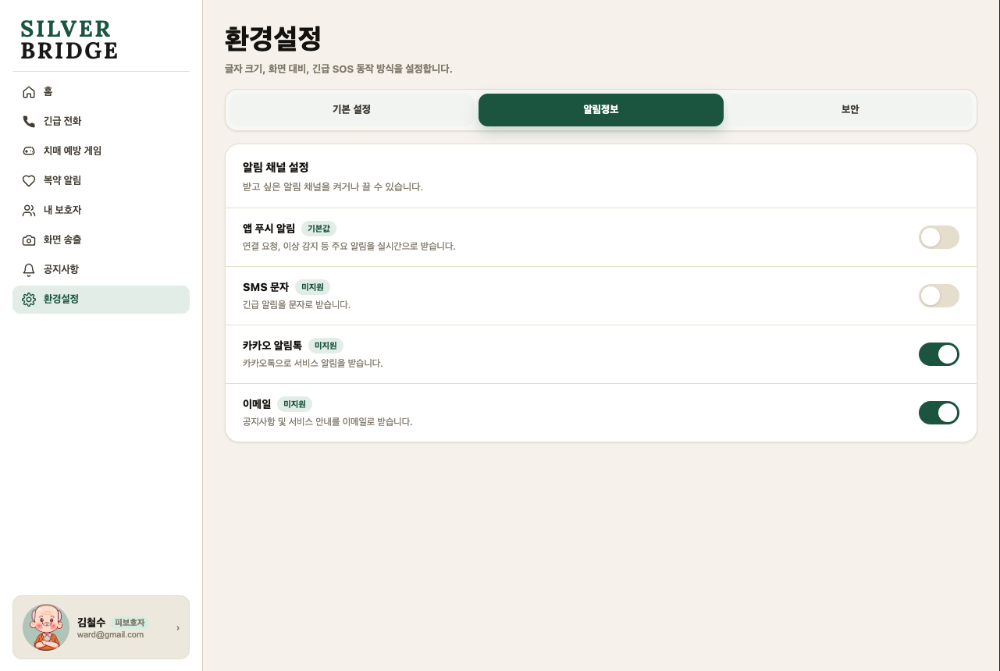

### 2.5 공통

- 마이페이지
- 공지사항 조회
  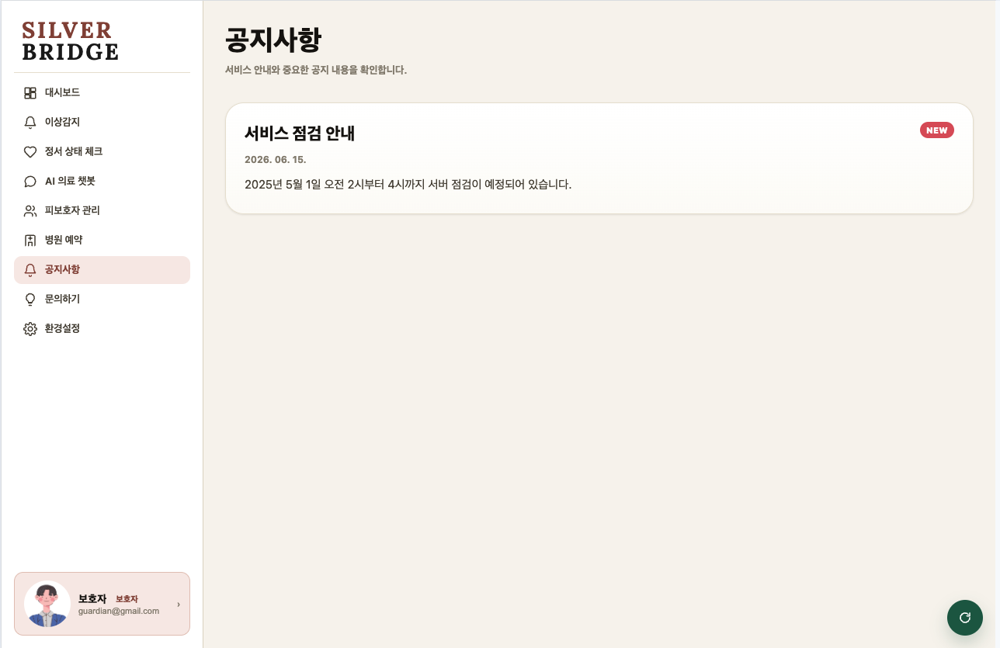

## 3. 서비스 흐름

```
[긴급 상황]
카메라 → AI 분석 (낙상·화재·흉기, YOLO 모델) → 위험 판단
  → 자동 신고 → 보호자·관리자 즉시 알림 (웹 푸시·이메일·SMS)

[평소 상황]
AI 의료 챗봇 → 증상 채팅 입력 → 모드 자동 분기
  ├─ 응급 증상  → MedGemma 의료 LLM 답변
  ├─ 병원 예약  → GPT 기반 예약 대화 → 병원 검색 → 예약 연결
  └─ 일반 문의  → GPT 기반 답변

[정서·인지 케어]
AI 말벗 (EXAONE)         → 음성 대화 → 외로움 해소·정서 케어
AI 정서 분석 (HSEmotion)  → 표정·텍스트 분석 → 이상 심리 조기 감지
치매 예방 인지훈련 게임   → 기억력·집중력 훈련
```

## 4. 기술 스택

### 4.1 Frontend [](https://github.com/Dongyang-Mirae-University-software/SilverBridgeFe)

| 분류      | 기술                          |
| --------- | ----------------------------- |
| Framework | Next.js (SSR + CSR 혼합 구조) |
| Language  | TypeScript                    |
| UI        | React, CSS Modules            |
| 서버 통신 | Axios, React Query            |
| 인프라    | Docker, Nginx (reverse proxy) |

### 4.2 Backend [](https://github.com/Dongyang-Mirae-University-software/SilverBridgeBe)

| 분류                 | 기술                          |
| -------------------- | ----------------------------- |
| Language / Framework | Java 21 / Spring Boot 4       |
| ORM                  | JPA, Hibernate                |
| 통신                 | WebClient, WebSocket, SSE     |
| Database             | PostgreSQL, Redis             |
| 인프라               | Docker, Nginx, GitHub Actions |

### 4.3 AI Backend [](https://github.com/Dongyang-Mirae-University-software/SilverBridgeAi)

| 분류                 | 기술                  |
| -------------------- | --------------------- |
| Language / Framework | Python / FastAPI      |
| 감지 모델            | YOLO (화재·흉기·낙상) |
| 의료 챗봇            | MedGemma, GPT         |
| 감정 분석            | HSEmotion             |
| AI 말벗              | EXAONE                |
| 인프라               | Docker, PyTorch       |

## 5. 개발 현황 (1학기 기말 기준)

| 기능                                         | 상태          |
| -------------------------------------------- | ------------- |
| 인증 시스템 (이메일·카카오 로그인, JWT)      | ✅ 완료       |
| AI 이상감지 (화재·흉기 탐지, WebSocket 연동) | 🔄 진행 중    |
| AI 의료 챗봇 (MedGemma + GPT 모드 분기)      | 🔄 진행 중    |
| 보호자 알림 (웹 푸시·이메일·SMS)             | 🔄 진행 중    |
| 카카오 알림톡 연동                           | 🔄 진행 중    |
| 낙상 감지 모델 학습                          | 📌 2학기 예정 |
| AI 감정 분석 / AI 말벗                       | 📌 2학기 예정 |
| 치매 예방 인지훈련 게임                      | 📌 2학기 예정 |
| 통합 테스트 / 배포                           | 📌 2학기 예정 |

## 6. 팀 구성

| 이름     | 역할                                                                                 |
| -------- | ------------------------------------------------------------------------------------ |
| 이하늘   | **팀장 / Infra** - 병원 예약 시스템, 인프라 아키텍처, AI 챗봇, 치매 예방 게임        |
| 남궁명진 | **Backend** - DB 설계, REST API, 인증/인가, 외부 서비스·AI 서버 연동, 품질/보안 관리 |
| 이윤아   | **Frontend** - Next.js/React 컴포넌트, UI/UX 설계, 반응형 레이아웃, 백엔드 API 연동  |
| 이재희   | **AI** - 감정 분석·이상감지·말벗 AI 개발 및 모델 학습                                |

## 7. 시연 영상 / 발표 자료

- **YouTube 시연 영상**:

  [](https://www.youtube.com/watch?v=y4lUm_REdXM)

- **중간발표 PPT**:

  [](docs/실버브릿지_중간발표.pptx)

- **최종발표 PPT**:

  [](docs/실버브릿지_최종발표.pptx)
